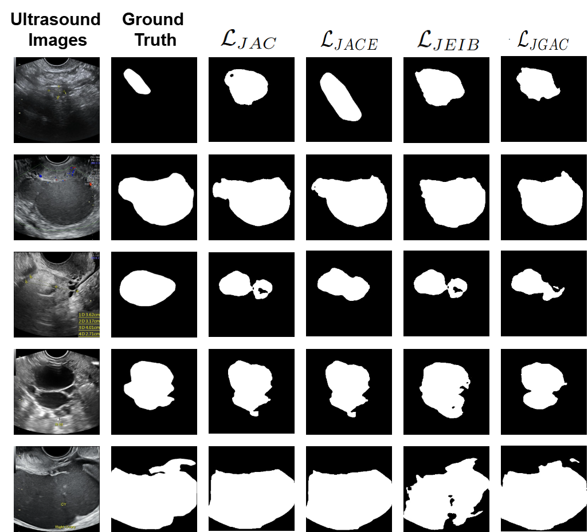

# Ovarian Tumor Segmentation from Ultrasound Images with Spatial Pooling and Contour-based Loss Functions⋆

This repository contains code and documentation for a machine learning project focused on segmentation ovarian tumors from ultrasound images (e.g., ultrasound images, clinical features, or combined modalities).

## 📌 Problem Statement

Automatic ovarian tumor segmentation in ultrasound imaging is essential for supporting early diagnosis and effective treatment. Although some significant progress has been made, this problem still faces challenges due to strong variability and unclear boundaries of ovarian tumors. To address the first issue, this study proposes a framework, namely CSA-SegNet (Combined Spatial Pooling with Attention for Ovarian Tumor Segmentation Network).

## 🎯 Objectives

- CSA-SegNet model that is unique combination of the VGG19 encoder for efficient feature extraction, an SPPF block that preserves critical spatial details while capturing multi-scale contextual information, and a newly designed loss function LJACE that emphasizes texture, shape, and contour similarity. 

## Output




## 📁 Dataset OTU2D
Link: https://drive.google.com/file/d/1SlTkOH70jBmd7Nbvx4DZaWeQtHk1PSH-/view?usp=sharing
> *Note: You can replace this section with actual dataset details.*


## ⚙️ Project Structure


## 🧠 Methodology

1. **Data Preprocessing**
The captured images undergo pre-processing before annotation. This pre-processing step includes removing personal data and eliminating markers added by doctors during ultrasound imaging. We utilize available IOPaint tool for inpainting the images, ensur-ing a clean and standardized dataset for annotation. Then the doctors use LabelMe tool for tumor region annotation

2. **Model Selection**
We implement the source code in Python and train the model on a computer equipped with an Intel Core i5-12400F CPU, 16GB DDR4 RAM, and an RTX 3060 GPU with 12GB VRAM. The implementation is supported by various
libraries, including OpenCV, NumPy, TensorFlow, Keras, and scikit-learn. We train the ovarian tumor segmentation model using training ultrasound images for 100 epochs with a batch size = 8. The learning rate is set to 1e-4. All ultrasound images were only resized to a fixed resolution of 256 × 256 pixels and and normalized to the range [0, 1] using min–max normalization before being used for model training and evaluation.

3. **Evaluation Metrics**
   - Accuracy
   - Precision / Recall / F1-score
   - Dice, IoU
   - HD

## 🚀 Getting Started

### Prerequisites

- Python 3.8+
- pip
- NVIDIA GeForce RTX 3060 12 GB RAM
- CUDA 12.4
- Ubuntu 20.04, tensorflow==2.6.0

### Installation

```bash
git clone https://github.com/yourusername/ovarian-tumor-segmentation.git
cd ovarian-tumor-segmentation
pip install -r requirements.txt

```
### Run
```bash
python main.py --mode train
