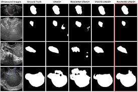

# Ovarian Tumor Segmentation from Ultrasound Images with Spatial Pooling and Contour-based Loss Functions⋆

This repository contains code and documentation for a machine learning project focused on segmentation ovarian tumors from ultrasound images (e.g., ultrasound images, clinical features, or combined modalities).

## 📌 Problem Statement

Automatic ovarian tumor segmentation in ultrasound imaging is essential for supporting early diagnosis and effective treatment. Although some significant progress has been made, this problem still faces challenges due to strong variability and unclear boundaries of ovarian tumors. To address the first issue, this study proposes a framework, namely CSA-SegNet (Combined Spatial Pooling with Attention for Ovarian Tumor Segmentation Network).

## 🎯 Objectives

- Preprocess clinical or imaging data related to ovarian tumors.
- 

## Framework




## 📁 Dataset OTU2D
Link: https://drive.google.com/file/d/1SlTkOH70jBmd7Nbvx4DZaWeQtHk1PSH-/view?usp=sharing
> *Note: You can replace this section with actual dataset details.*


## ⚙️ Project Structure


## 🧠 Methodology

1. **Data Preprocessing**
   - Cleaning missing values
   - Feature normalization/scaling
   - Image preprocessing (if applicable)

2. **Model Selection**
   
   - Advanced: Deep Learning (CNN for images)

3. **Evaluation Metrics**
   - Accuracy
   - Precision / Recall / F1-score
   - Dice, IoU
   - HD

## 🚀 Getting Started

### Prerequisites

- Python 3.8+
- pip
- NVIDIA GeForce RTX 3060 12 GB RAM
- CUDA 12.4
- Ubuntu 20.04, tensorflow==2.6.0

### Installation

```bash
git clone https://github.com/yourusername/ovarian-tumor-segmentation.git
cd ovarian-tumor-segmentation
pip install -r requirements.txt

```
### Run
```bash
python main.py --mode train
